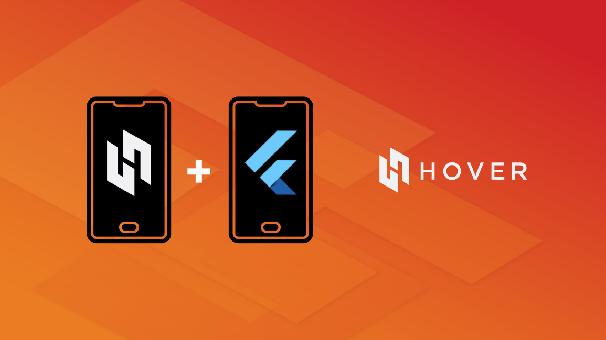

# hover_ussd


[](https://pub.dartlang.org/packages/hover_ussd)
[](https://github.com/lucdotdev/hover_ussd)
[](https://flutter.dev/docs/development/data-and-backend/state-mgmt/options#bloc--rx)
[](https://opensource.org/licenses/MIT)



A flutter plugin to make payments by usehover.com ussd gateway using Android Intent and receiving the transaction information back in response. 
**android only**

## Getting Started

* Adding The hover api key refert to documentation at [docs.usehover.com](https://docs.usehover.com/)

```xml
 <meta-data
        android:name="com.hover.ApiKey"  
        android:value="<YOUR_API_TOKEN>"/>
```
## Usage
* Example
```dart 
import 'package:hover_ussd/hover_ussd.dart';
...
final HoverUssd _hoverUssd = HoverUssd(branding: "My Awaesome app", logo:"myLogo_added");

///Begin transaction
void send(){
  _hoverUssd.sendUssd(actionId: "c6e45e62", extras: {"price": "4000"});;
}

///Listen for transaction status
 _hoverUssd.onTransactiontateChanged.listen((event) {
        // Do something with new state
        if (event == TransactionState.succesfull) {
          print("succesfull");
        } else if (event == TransactionState.waiting) {
          print("pending");
        } else if (event == TransactionState.failed) {
          print('failed');
        }
  });
///You can listen with StreamBuilder to update ui
 StreamBuilder(
     stream: _hoverUssd.onTransactiontateChanged,
        builder: (BuildContext context, AsyncSnapshot snapshot) {
                  
          return Text("no transaction");
   },
);

```
## Features
  - [x] start a transaction
  - [x] listen for result  
  - [x] customization
  - [ ] translation
  
## Important
 

 * **Production ready**
 * **This is a unofficial plugin**
      
## Maintainers
- [lucdotdev](mailto:lucdotdev@gmail.com)
 
